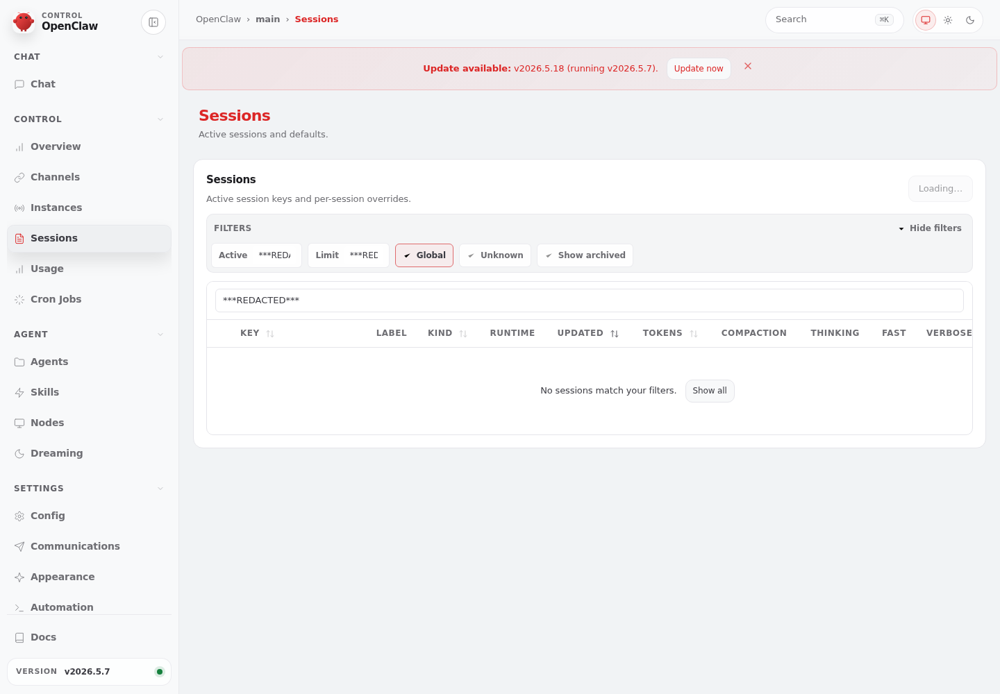
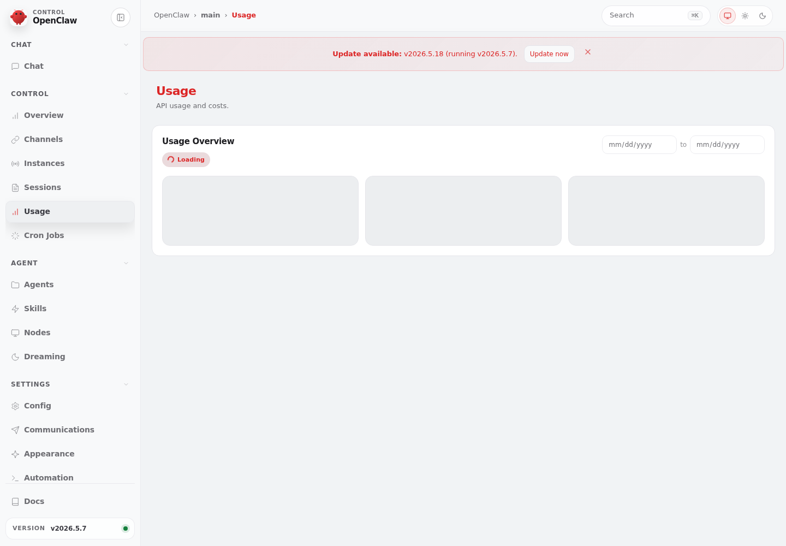
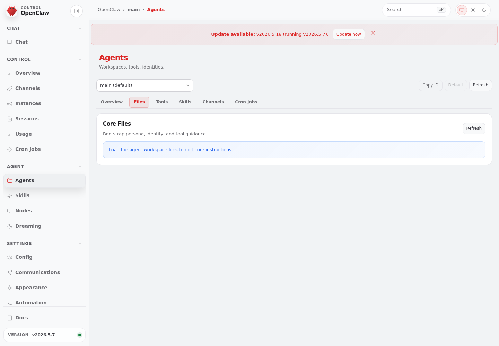

# OpenClaw Dashboard Screenshot

Captured from the VPS-local OpenClaw Control UI on 2026-05-20T09:38:28.591Z.

Sensitive tokens/IDs/emails were redacted before committing.

## Files

- `dashboard-overview-redacted.png`

## Redacted text snapshot

```text
Title: OpenClaw Control

OpenClaw
›
main
›
Overview
Search
⌘K
CONTROL
OpenClaw
CHAT
Chat
CONTROL
Overview
Channels
Instances
Sessions
Usage
Cron Jobs
AGENT
Agents
Skills
Nodes
Dreaming
SETTINGS
Config
Communications
Appearance
Automation
Infrastructure
AI & Agents
Debug
Logs
Docs
VERSION
v2026.5.7
Update available: v2026.5.18 (running v2026.5.7). Update now 
Overview
Status, entry points, health.
Gateway Access
Where the dashboard connects and how it authenticates.
WebSocket URL
Gateway Token
Password (not stored)
Default Session Key
Language
English
简体中文 (Simplified Chinese)
繁體中文 (Traditional Chinese)
Português (Brazilian Portuguese)
Deutsch (German)
Español (Spanish)
日本語 (Japanese)
한국어 (Korean)
Français (French)
العربية (Arabic)
Italiano (Italian)
Türkçe (Turkish)
Українська (Ukrainian)
Bahasa Indonesia (Indonesian)
Polski (Polish)
ไทย (Thai)
Tiếng Việt (Vietnamese)
Nederlands (Dutch)
فارسی (Persian)
Connect
Refresh
Click Connect to apply connection changes.
Snapshot
Latest gateway handshake information.
STATUS
OK
UPTIME
3d
TICK INTERVAL
30s
LAST CHANNELS REFRESH
just now
Use Channels to link WhatsApp, Telegram, Discord, Signal, or iMessage.
Attention
1 cron job failed
daily-worklog-23-kst
Event Log
24
9:38:25 AM
control-ui.refresh
{ "tab": "overview", "phase": "end", "status": "ok", "durationMs": 952 }
9:38:25 AM
control-ui.rpc
{ "id": "***REDACTED***", "method": "cron.list", "ok": true, "durationMs": 942, "slow":
9:38:25 AM
control-ui.rpc
{ "id": "***REDACTED***", "method": "channels.status", "ok": true, "durationMs": 925, "s
9:38:25 AM
control-ui.rpc
{ "id": "***REDACTED***", "method": "cron.status", "ok": true, "durationMs": 920, "slow"
9:38:25 AM
control-ui.rpc
{ "id": "***REDACTED***", "method": "system-presence", "ok": true, "durationMs": 883, "s
9:38:24 AM
***REDACTED***
{ "tab": "overview", "name": "long-animation-frame", "startTimeMs": 6313, "durationMs": 75, "blockingDurationM
9:38:24 AM
control-ui.tab.visible
{ "previousTab": "chat", "tab": "overview", "durationMs": 72 }
9:38:24 AM
control-ui.refresh
{ "tab": "overview", "phase": "start" }
9:38:23 AM
***REDACTED***
{ "tab": "chat", "name": "long-animation-frame", "startTimeMs": 4939, "durationMs": 379, "blockingDurationMs":
9:38:22 AM
control-ui.rpc
{ "id": "***REDACTED***", "method": "chat.history", "ok": true, "durationMs": 4564, "slo
9:38:22 AM
control-ui.rpc
{ "id": "***REDACTED***", "method": "device.pair.list", "ok": true, "durationMs": 4527,
9:38:22 AM
control-ui.rpc
{ "id": "***REDACTED***", "method": "node.list", "ok": true, "durationMs": 4523, "slow":
9:38:21 AM
***REDACTED***
{ "tab": "chat", "name": "long-animation-frame", "startTimeMs": 2768, "durationMs": 650, "blockingDurationMs":
9:38:21 AM
control-ui.rpc
{ "id": "***REDACTED***", "method": "models.list", "ok": true, "durationMs": 3022, "slow
9:38:21 AM
control-ui.rpc
{ "id": "***REDACTED***", "method": "commands.list", "ok": true, "durationMs": 3018, "sl
9:38:21 AM
control-ui.rpc
{ "id": "***REDACTED***", "method": "health", "ok": true, "durationMs": 3019, "slow": tr
9:38:21 AM
control-ui.rpc
{ "id": "***REDACTED***", "method": "agents.list", "ok": true, "durationMs": 2791, "slow
9:38:18 AM
control-ui.rpc
{ "id": "***REDACTED***", "method": "agent.identity.get", "ok": true, "durationMs": 270,
9:38:18 AM
control-ui.rpc
{ "id": "***REDACTED***", "method": "sessions.subscribe", "ok": true, "durationMs": 269,
9:38:18 AM
***REDACTED***
{ "tab": "chat", "name": "long-animation-frame", "startTimeMs": 379, "durationMs": 136, "blockingDurationMs":
```

## Additional dashboard tabs

Captured on 2026-05-20T10:08:45.413Z. Sensitive tokens/IDs/emails were redacted before committing.

## Sessions



<details><summary>Redacted text snapshot</summary>

```text
OpenClaw
›
main
›
Sessions
Search
⌘K
CONTROL
OpenClaw
CHAT
Chat
CONTROL
Overview
Channels
Instances
Sessions
Usage
Cron Jobs
AGENT
Agents
Skills
Nodes
Dreaming
SETTINGS
Config
Communications
Appearance
Automation
Infrastructure
AI & Agents
Debug
Logs
Docs
VERSION
v2026.5.7
Update available: v2026.5.18 (running v2026.5.7). Update now 
Sessions
Active sessions and defaults.
Sessions
Active session keys and per-session overrides.
Loading…
FILTERS
Hide filters
Active
Limit
Global
Unknown
Show archived
	KEY 
	LABEL	KIND 
	RUNTIME	UPDATED 
	TOKENS 
	COMPACTION	THINKING	FAST	VERBOSE	REASONING

No sessions match your filters.
Show all
```

</details>

## Usage



<details><summary>Redacted text snapshot</summary>

```text
OpenClaw
›
main
›
Usage
Search
⌘K
CONTROL
OpenClaw
CHAT
Chat
CONTROL
Overview
Channels
Instances
Sessions
Usage
Cron Jobs
AGENT
Agents
Skills
Nodes
Dreaming
SETTINGS
Config
Communications
Appearance
Automation
Infrastructure
AI & Agents
Debug
Logs
Docs
VERSION
v2026.5.7
Update available: v2026.5.18 (running v2026.5.7). Update now 
Usage
API usage and costs.
Usage Overview
Loading
to
```

</details>

## Agents



<details><summary>Redacted text snapshot</summary>

```text
OpenClaw
›
main
›
Agents
Search
⌘K
CONTROL
OpenClaw
CHAT
Chat
CONTROL
Overview
Channels
Instances
Sessions
Usage
Cron Jobs
AGENT
Agents
Skills
Nodes
Dreaming
SETTINGS
Config
Communications
Appearance
Automation
Infrastructure
AI & Agents
Debug
Logs
Docs
VERSION
v2026.5.7
Update available: v2026.5.18 (running v2026.5.7). Update now 
Agents
Workspaces, tools, identities.
main (default)
bill
chanyeongbot
hyeonwoobot
jinhobot
jinseongbot
junhobot
lycos
migyeongbot
robertbot
soonyongbot
tiago
Copy ID
Default
Refresh
Overview
Files
Tools
Skills
Channels
Cron Jobs
Core Files
Bootstrap persona, identity, and tool guidance.
Refresh
Load the agent workspace files to edit core instructions.
```

</details>

